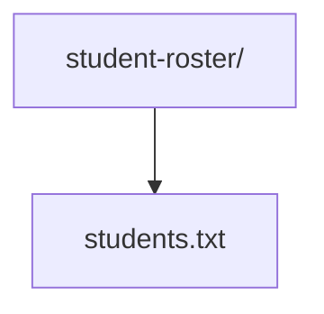
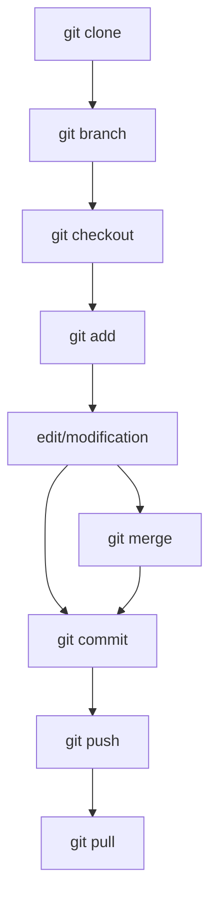

## Student Roster! by <CodeCraft Circle> [Team]
---

[some videos link share] : url(`https://drive.google.com/drive/folders/12Eaw1kEeuhPtBPldbO8CSlmsVni_NhH_`)
---

# Project: Student Roster

## Step 1: Create a new repository

1. Create a new folder: student-roster
2. Initialize a new Git repository: git init
3. Create a new file: students.txt

## Step 2: Add initial content

1. Add the following content to students.txt:
Username,Fname,Lname,UGNumber

2. Commit the changes: git add . and git commit -m "Initial commit"

## Step 3: Collaborate

1. Create a new branch for each collaborator: git branch <username>
2. Switch to the new branch: git checkout <username>
3. Add your details to students.txt:
Username,Fname,Lname,UGNumber
<username>,<fname>,<lname>,<ugNumber>

4. Commit the changes: git add . and git commit -m "Added <username> details"
5. Push the branch to the remote repository (if set up)

Step 4: Merge changes

1. Switch to the main branch: git checkout main
2. Merge the changes from each collaborator's branch: git merge <username>

## Folder structure:

---
### Example students.txt
| **Username** | **Fname** | **Lname** | **UGNumber** |
|----------|-------|-------|----------|
| johnDoe  | John  | Doe   | 12345    |
| janeDoe  | Jane  | Doe   | 67890    |

## Git commands to practice:

## Steps for each collaborator:

1. Clone the repository: git clone <repository-url>
2. Create a new branch: git branch <username>
3. Switch to the new branch: git checkout <username>
4. Add your details to students.txt
5. Commit the changes: git add . and git commit -m "Added <username> details"
6. Push the branch to the remote repository: git push origin <username>
7. Create a pull request to merge your branch with the main branch
---
## **This project allows each collaborator to practice Git commands while working on a simple task.**
---
